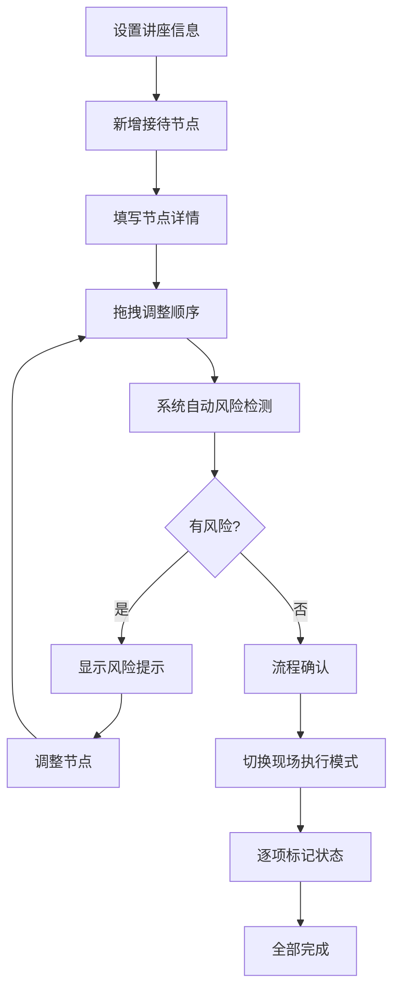

## 1. 产品概述

讲座接待流程编排系统，帮助会务团队在讲座当天按时间顺序规划和执行各项接待事项。所有数据仅保存在当前浏览器会话，无需持久化存储。系统通过可视化时间线、自动风险检测和多维度筛选，提升现场执行效率。

### 1.1 核心价值
- 将复杂的接待流程可视化、结构化，避免遗漏
- 自动检测时间冲突、人员过载等风险，提前预警
- 支持快速调整和现场执行模式，适应突发变化

## 2. 核心功能

### 2.1 用户角色
| 角色 | 使用场景 | 核心权限 |
|------|----------|----------|
| 会务负责人 | 前期流程编排、现场指挥 | 完整操作权限：新增、编辑、删除、拖拽排序、批量操作 |
| 现场执行人员 | 查看待办事项、更新状态 | 查看筛选、更新节点状态 |

### 2.2 功能模块
1. **流程时间线主视图**：纵向时间轴展示所有接待事项，支持拖拽调整顺序
2. **节点编辑面板**：填写事项名称、时间、负责人、物品、状态、备注
3. **风险检测面板**：实时显示时间重叠、人员过密、物品缺失、超时等提醒
4. **筛选工具栏**：按负责人、状态、时间段、是否有提醒筛选
5. **批量操作栏**：多选节点后批量标记状态
6. **现场执行清单视图**：独立视图，仅显示未完成和需延后的事项

### 2.3 页面详情
| 页面名称 | 模块名称 | 功能描述 |
|----------|----------|----------|
| 主页面 | 顶部工具栏 | 讲座基本信息设置（开始时间、缓冲区）、视图切换、新增节点、快速复制 |
| 主页面 | 筛选栏 | 负责人下拉、状态多选、时间段范围、仅显示有提醒 |
| 主页面 | 时间线区域 | 纵向排列节点卡片，左侧时间轴，支持HTML5拖拽排序 |
| 主页面 | 节点卡片 | 展示节点核心信息，点击展开编辑，状态标签，风险角标 |
| 主页面 | 风险侧边栏 | 实时风险列表，点击定位到对应节点 |
| 现场执行清单 | 待办列表 | 按时间排序，仅显示未完成/需延后事项，大按钮更新状态 |

## 3. 核心流程

### 3.1 流程编排流程
用户设置讲座基本信息 → 新增/复制接待节点 → 填写节点详情 → 拖拽调整顺序 → 系统自动校验并提示风险 → 确认流程

### 3.2 现场执行流程
切换到现场执行视图 → 查看待办事项 → 执行完成后标记状态 → 系统自动更新下一项提示

## 4. 用户界面设计

### 4.1 设计风格
- **风格定位**：专业行政风格，克制严谨，注重信息层次和操作效率
- **主色调**：藏青色 `#1e3a5f`（专业、可信赖）
- **辅助色**：琥珀色 `#d97706`（提醒/需延后）、翠绿色 `#059669`（已完成）、天蓝色 `#0284c7`（准备中）、银灰色 `#6b7280`（未开始）
- **中性色**：以 slate 色系为基底，层次分明
- **按钮风格**：圆角 6px， subtle 阴影，hover 状态轻微上浮
- **字体**：标题使用 'Noto Sans SC'，正文使用系统无衬线字体，字号层级清晰（12px/14px/16px/20px/24px）
- **布局**：三栏布局（筛选工具栏 + 时间线主区 + 风险侧边栏），卡片式节点，左侧垂直线性时间轴
- **图标**：使用 lucide-vue-next 图标库，线性风格，统一 16px/18px 尺寸

### 4.2 页面设计概述
| 页面名称 | 模块名称 | UI 元素 |
|----------|----------|----------|
| 主页面 | 顶部信息栏 | 讲座名称输入、开始时间选择、缓冲区设置（分钟）、视图切换标签 |
| 主页面 | 筛选工具栏 | 负责人多选下拉、状态复选框组、时间范围选择器、提醒开关 |
| 主页面 | 时间线区域 | 左侧垂直时间轴（带时间刻度），节点卡片交错排列，拖拽时高亮放置区域 |
| 主页面 | 节点卡片 | 状态色条（左侧边）、事项名称、时间区间、负责人标签、物品图标、风险角标、展开/收起箭头 |
| 主页面 | 节点编辑区 | 表单项：名称、开始时间、预计分钟、负责人（下拉+可输入）、物品（标签输入）、状态选择、备注文本域 |
| 主页面 | 风险侧边栏 | 风险类型图标、风险描述、关联节点、"去查看"按钮 |
| 现场执行清单 | 待办卡片 | 大号状态切换按钮、事项名称、倒计时/延迟提示、负责人、快速备注 |

### 4.3 响应式设计
- **桌面端**（≥ 1280px）：三栏完整布局，风险栏固定右侧
- **平板端**（768px - 1279px）：风险栏改为可折叠抽屉，时间线占满宽度
- **移动端**（< 768px）：筛选栏折叠，时间线单列，节点卡片简化信息

### 4.4 交互动效
- 节点展开/收起：高度过渡 + 淡入淡出，200ms ease
- 拖拽排序：拖动节点半透明，放置区域高亮边框，释放后平滑过渡
- 风险检测更新：新风险项滑入，带轻微琥珀色背景闪烁
- 状态切换：状态标签颜色渐变，勾选动画
- 页面加载：顶部信息栏 → 筛选栏 → 时间线节点 依次淡入， staggered 延迟 50ms

## 5. 核心业务规则

### 5.1 自动检测规则
1. **时间重叠检测**：相邻节点时间区间有交集即标记
2. **负责人连续任务过密**：同一负责人相邻任务间隔 < 10 分钟标记
3. **所需物品缺失**：物品字段为空且状态 ≠ 已完成 时标记（可选提醒）
4. **结束时间超时**：最后一个节点结束时间 > 讲座开始时间 - 缓冲区 时标记

### 5.2 时间顺序规则
1. 拖拽调整顺序后，系统立即重新计算所有提示和风险
2. 用户手动修改时间导致与相邻节点顺序不一致时，显示橙色警告条 "时间顺序与排列顺序不一致，建议调整"，但不自动覆盖
3. 快速复制上一节点时，开始时间默认设为上一节点结束时间

### 5.3 数据规则
1. 所有数据仅存储在 Vue 响应式状态中，刷新页面即清空
2. 每个节点必须有唯一 ID（UUID 生成）
3. 状态枚举：`not_started` / `in_preparation` / `completed` / `delayed`
