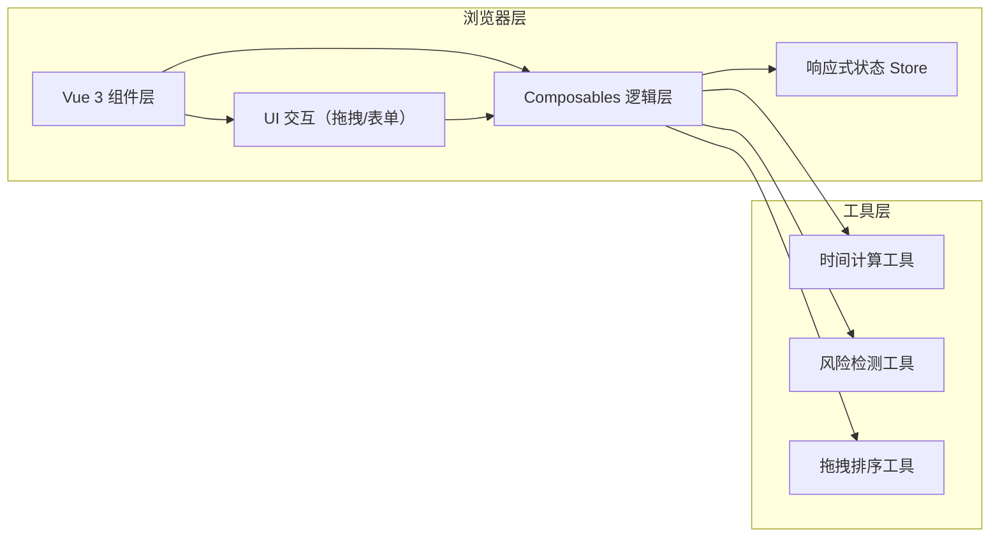
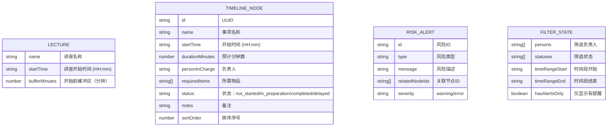

## 1. 架构设计

本项目为纯前端单页应用，无需后端服务。所有数据存储在浏览器内存（Vue 响应式状态）中，刷新即清空。



## 2. 技术选型说明

| 技术 | 版本 | 用途 |
|------|------|------|
| Vue | 3.4.x | 前端框架，Composition API |
| TypeScript | 5.4.x | 类型安全 |
| Vite | 5.2.x | 构建工具 |
| Tailwind CSS | 3.4.x | CSS 框架 |
| lucide-vue-next | 0.378.x | 图标库 |
| vuedraggable | 4.1.x | Vue 拖拽排序组件（封装 sortablejs） |

## 3. 项目结构

```
src/
├── components/
│   ├── Timeline/
│   │   ├── TimelineContainer.vue    # 时间线容器
│   │   ├── TimelineNode.vue         # 节点卡片
│   │   └── NodeEditor.vue           # 节点编辑表单
│   ├── Filters/
│   │   ├── FilterBar.vue            # 筛选工具栏
│   │   └── BatchActionBar.vue       # 批量操作栏
│   ├── RiskPanel/
│   │   └── RiskSidebar.vue          # 风险侧边栏
│   ├── Execution/
│   │   └── ExecutionListView.vue    # 现场执行清单
│   └── common/
│       ├── StatusBadge.vue          # 状态标签
│       └── TimeInput.vue            # 时间输入组件
├── composables/
│   ├── useTimeline.ts               # 时间线核心逻辑
│   ├── useRiskDetection.ts          # 风险检测逻辑
│   ├── useFilters.ts                # 筛选逻辑
│   └── useDragSort.ts               # 拖拽排序逻辑
├── types/
│   └── index.ts                     # 类型定义
├── utils/
│   ├── timeUtils.ts                 # 时间计算工具
│   └── uuid.ts                      # UUID 生成工具
├── App.vue
├── main.ts
└── style.css
```

## 4. 数据模型定义



## 5. 核心类型定义

```typescript
// 节点状态
export type NodeStatus = 'not_started' | 'in_preparation' | 'completed' | 'delayed';

// 风险类型
export type RiskType = 'time_overlap' | 'person_overload' | 'items_missing' | 'end_time_exceed' | 'order_mismatch';

// 流程节点
export interface TimelineNode {
  id: string;
  name: string;
  startTime: string; // HH:mm 格式
  durationMinutes: number;
  personInCharge: string;
  requiredItems: string[];
  status: NodeStatus;
  notes: string;
  sortOrder: number;
}

// 讲座信息
export interface LectureInfo {
  name: string;
  startTime: string; // HH:mm 格式
  bufferMinutes: number;
}

// 风险提醒
export interface RiskAlert {
  id: string;
  type: RiskType;
  message: string;
  relatedNodeIds: string[];
  severity: 'warning' | 'error';
}

// 筛选条件
export interface FilterState {
  persons: string[];
  statuses: NodeStatus[];
  timeRangeStart: string;
  timeRangeEnd: string;
  hasAlertsOnly: boolean;
}

// 批量操作
export interface BatchOperation {
  selectedIds: string[];
  targetStatus: NodeStatus | null;
}
```

## 6. 核心业务逻辑

### 6.1 风险检测机制
- **触发时机**：节点增删改、拖拽排序、讲座信息变更时自动触发
- **检测顺序**：时间重叠 → 人员过载 → 物品缺失 → 结束超时 → 顺序不一致
- **去重策略**：按 `type + relatedNodeIds` 去重，避免重复提醒

### 6.2 时间计算工具函数
```typescript
// HH:mm 转分钟数（当天零点起）
parseTimeToMinutes(time: string): number

// 分钟数转 HH:mm
formatMinutesToTime(minutes: number): string

// 计算节点结束时间
getEndTime(node: TimelineNode): string

// 检查两个时间区间是否重叠
isTimeOverlap(start1: string, end1: string, start2: string, end2: string): boolean

// 计算两个时间点的间隔（分钟）
getTimeGap(time1: string, time2: string): number
```

### 6.3 拖拽排序逻辑
- 使用 `vuedraggable` 封装 HTML5 拖拽
- 拖拽结束后更新 `sortOrder` 字段
- 触发风险检测重新计算
- 支持点击节点时的展开/收起与拖拽的冲突处理

### 6.4 状态管理方案
使用 Vue 3 Composition API + `reactive`/`ref` 进行状态管理，不引入额外状态管理库：
- `timelineNodes: ref<TimelineNode[]>` - 节点列表
- `lectureInfo: reactive<LectureInfo>` - 讲座信息
- `filters: reactive<FilterState>` - 筛选条件
- `risks: computed<RiskAlert[]>` - 计算属性自动生成风险列表
- `filteredNodes: computed<TimelineNode[]>` - 计算属性返回筛选后节点

## 7. 路由定义

单页应用，使用 Vue Router 管理两个视图：

| 路由路径 | 页面名称 | 说明 |
|----------|----------|------|
| `/` | 流程编排主视图 | 默认路由，时间线 + 筛选 + 风险栏 |
| `/execution` | 现场执行清单 | 仅显示未完成和需延后事项 |

## 8. 组件通信方式

1. **Props / Emit**：父子组件常规通信
2. **Provide / Inject**：跨层级共享讲座信息和全局配置
3. **Composables**：共享业务逻辑（useTimeline, useRiskDetection 等）
4. **Computed 计算属性**：派生状态（风险列表、筛选结果）

## 9. 性能优化点

1. **虚拟滚动**：节点数量 > 50 时启用虚拟滚动（预留接口）
2. **计算属性缓存**：风险检测、筛选结果使用 computed 缓存
3. **事件防抖**：时间输入、文本输入使用 300ms 防抖
4. **v-memo**：节点卡片使用 v-memo 优化重渲染
5. **按需更新**：拖拽排序时只更新 sortOrder，不重建数组
